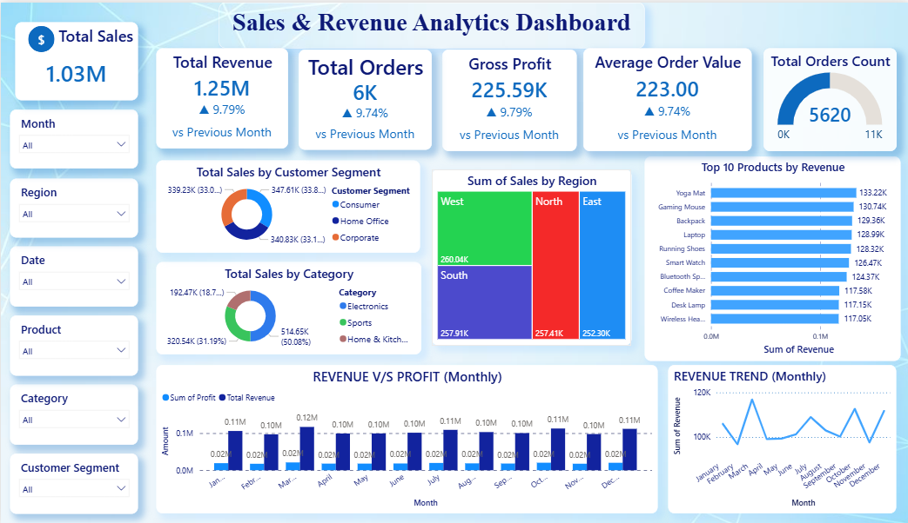

# 📊Sales & Revenue Analytics Dashboard

## 🚀Project Overview

The Sales & Revenue Analytics Dashboard is an interactive Power BI solution designed to monitor business performance through key sales and revenue metrics. The dashboard transforms raw transactional data into meaningful insights, enabling stakeholders to track revenue, profit, orders, customer segments, regional performance, and product performance from a single view.

This project demonstrates how Business Intelligence can be used to support data-driven decision-making and improve overall business efficiency.

## 📷Dashboard Preview

## 🎯 Problem Statement

Organizations generate large volumes of sales data across multiple products, regions, and customer segments. However, analyzing this data manually is time-consuming and often fails to provide actionable insights.

A centralized dashboard is required to monitor business performance, identify growth opportunities, track profitability, and support strategic decision-making.

## 🎯 Business Objectives

-> Monitor overall sales and revenue performance.
-> Track business KPIs through an interactive dashboard.
-> Analyze revenue and profitability trends.
-> Identify top-performing products.
-> Evaluate regional sales performance.
-> Understand customer segment contributions.
-> Enable data-driven business decisions.

## 🛠️ Tools & Technologies Used

- Power BI Desktop
- Power Query
- DAX (Data Analysis Expressions)
- Microsoft Excel

## 📌 Dashboard Features

- KPI Monitoring
- Revenue Analysis
- Profit Analysis
- Customer Segmentation
- Regional Performance Analysis
- Product Performance Analysis
- Monthly Trend Analysis

### KPI Monitoring
- Total Sales
- Total Revenue
- Total Orders
- Gross Profit
- Average Order Value

### Customer Segment Analysis
- Consumer
- Corporate
- Home Office

### Regional Performance Analysis
- West
- East
- North
- South

### Product Performance Analysis
- Top 10 Products by Revenue

### Trend Analysis
- Monthly Revenue Trend
- Revenue vs Profit Comparison

### Interactive Filtering
- Month Filter
- Region Filter
- Product Filter
- Category Filter
- Customer Segment Filter

## 🔍 Key Insights

- Total Revenue exceeded ₹1.25 Million.
- Gross Profit reached ₹225.59K.
- Consumer segment contributed the highest revenue share.
- West region generated the highest sales performance.
- Revenue remained relatively stable throughout the year.
- Yoga Mat emerged as the top revenue-generating product.
- Average Order Value reached ₹223 per transaction.

## 💡 Business Recommendations

- Focus marketing efforts on the Consumer segment.
- Increase inventory for high-performing products.
- Replicate successful strategies from the West region.
- Improve profit margins through cost optimization.
- Implement upselling and cross-selling initiatives.
- Continuously monitor monthly sales trends for forecasting.

## 📄 Documentation

Detailed project documentation, methodology, dashboard explanation, insights, and business recommendations are available in:

[View Complete Project Documentation](Documentation/Sales_Revenue_Analytics_Report.pdf)

## ✅ Project Outcome

This dashboard successfully converts raw sales data into actionable business insights by providing:

- Centralized business performance monitoring
- Revenue and profit tracking
- Customer segmentation analysis
- Regional sales evaluation
- Product performance analysis
- Interactive business reporting

The project demonstrates the use of Power BI as a Business Intelligence tool for improving decision-making and identifying growth opportunities.
